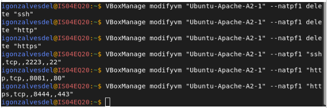

# Actividad 2.1 — Instalación y Despliegue Básico con Apache

## Descripción del Proyecto
Este proyecto consiste en la instalación y configuración del servidor web Apache en una máquina virtual con Ubuntu 22.04. Se despliega un sitio web estático sencillo que incluye navegación entre páginas, imágenes y hojas de estilo CSS. El objetivo es comprobar el correcto funcionamiento del servidor web y el acceso desde el host a través del puerto 80.

## Pasos de Instalación y Despliegue

1. **Actualización del sistema**
    ```bash
    sudo apt update && sudo apt upgrade -y
    ```

2. **Instalación de Apache**
    ```bash
    sudo apt install apache2 -y
    ```

3. **Comprobación del estado del servicio**
    ```bash
    sudo systemctl status apache2
    ```

4. **Habilitar inicio automático del servicio**
    ```bash
    sudo systemctl enable apache2
    ```

5. **Configuración de red para acceso desde el host**
    - Configuración NAT + Port Forward o Adaptador Host-Only.

6. **Despliegue del sitio web**
    - Se colocan los archivos HTML, CSS e imágenes en:
    ```bash
    /var/www/html/
    ```

---

## Capturas de Pantalla del Proceso

### Creacion Snapshot


### Configuracion red


### Instalacion Apache


### Comprobacion estado de apache


### Pagina por defecto de Apache


### Actualizacion pagina de Apache


### Arbol y permisos


---

## Problemas Encontrados y Soluciones

| Problema | Causa | Solución |
|---------|-------|----------|


---

## Enlace al Repositorio
https://github.com/RispiGonzalves/despr2_1_apache
---

### Autor
Ivan Gonzalves del Valle
